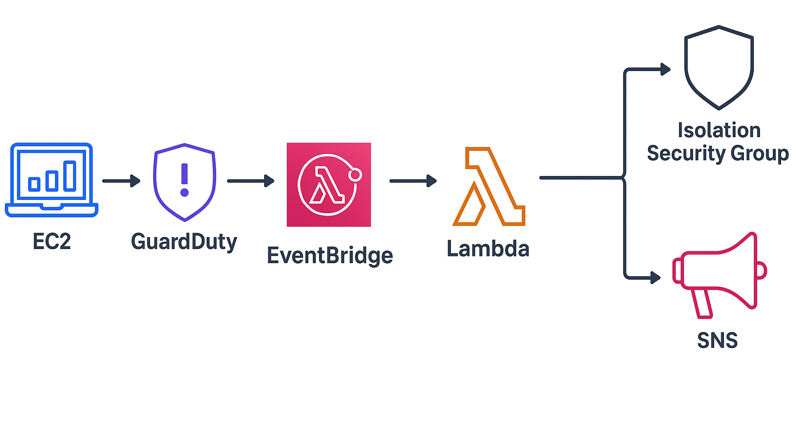

# AWS CSS - Domain 1 - Automated Threat Response with GuardDuty, Event Bridge, Lambda & SNS.

Built an automated incident response workflow in AWS using GuardDuty, EventBridge, Lambda and SNS to detect threats, quarantine compromised EC2 instances and notify the security team in real time.

**Why it matters:** Automated detection and isolation reduce attacker dwell time and minimize damage during cloud security incidents.

---

## Table of Contents

- [Overview](#overview)  
- [Objectives](#objectives)  
- [Diagram](#diagram)  
- [Steps Performed](#steps-performed) 
  - [1. EC2 Setup & Suspicious Activity]  
  - [2. GuardDuty Detection]  
  - [3. EventBridge Rule] 
  - [4. Lambda Quarantine Function]  
  - [5. Lambda Debugging & Fix]  
  - [6. EC2 Quarantine Verification]  
  - [7. Notifications with SNS]
  - [8. Cleanup]
- [Screenshots](#screenshots) 
- [Lessons Learned](#lessons-learned)  
- [References](#references)  
- [Contact](#contact)

---

## Overview

Cloud incidents happen fast — from crypto-mining malware hijacking EC2s to attackers exfiltrating data through DNS tunnels. Manual response is too slow.  

This lab demonstrates **end-to-end automated incident response** in AWS:
  - **Detection** → GuardDuty flags suspicious activity.  
  - **Triggering** → EventBridge routes the finding.  
  - **Response** → Lambda automatically quarantines the EC2.  
  - **Notification** → SNS sends an email alert to the security team.  

---

## Objectives

- Show ability to **detect, contain and notify** during a cloud incident.  
- Simulate a compromised EC2 instance generating malicious traffic.  
- Detect the activity with **Amazon GuardDuty**.  
- Automate incident response using **EventBridge + Lambda**.  
- Quarantine the compromised EC2 by swapping to an **Isolation Security Group**.  
- Send real-time **SNS email notifications**.  

---

## Diagram

Compromised EC2 → GuardDuty Finding → EventBridge Rule → Lambda Function → EC2 Quarantine + SNS Alert 

---

## Steps Performed

- **1. EC2 Setup & Suspicious Activity**  
   - Launched an EC2 instance in a VPC for testing.  
   - Connected via SSH with private key.  
   - Simulated suspicious activity using GuardDuty test domain and DNS lookups *(Screenshots: `EC2-Launched.png`, `EC2-SSH-Connected.png` & `EC2-Suspicious-Command.png`)*  

- **2. GuardDuty Detection**  
   - Enabled Amazon GuardDuty in the region.  
   - Generated sample findings via AWS CLI for faster testing.  
   - Verified findings in the GuardDuty console *(Screenshot: `GuardDuty-Findings.png`)*  

- **3. EventBridge Rule**  
   - Created EventBridge rule with pattern for `GuardDuty Finding`.  
   - Configured rule to target Lambda function *(Screenshot: `EventBridge-Rule.png`)*  

- **4. Lambda Quarantine Function**  
   - Wrote Lambda function in Python to:  
     - Swap EC2 instance to Isolation Security Group.  
     - Add tag `Status=Quarantined`.  
   - Attached IAM role with EC2 modify and tagging permissions.  
   - Tested Lambda with a sample GuardDuty event *(Screenshots: `Lambda-Code.png`, `Lambda-IAM-Policy.png` & `Lambda-Test.png`)*  

- **5. Lambda Debugging & Fix**  
   - Initial test failed due to missing permissions (`UnauthorizedOperation`).  
   - Fixed IAM policy to include `ec2:ModifyInstanceAttribute` and `ec2:CreateTags`.  
   - Verified successful quarantine execution in CloudWatch logs *(Screenshots: `Lambda-Logs.png` & `Lambda-Logs-Fixed.png`)*  

- **6. EC2 Quarantine Verification**  
   - Checked EC2 instance details:  
     - Security Group replaced with Isolation SG.  
     - Tag added: `Status=Quarantined` *(Screenshots: `EC2-Isolated-SG.png` & `EC2-Quarantined-Tag.png`)*  

- **7. Notifications with SNS**  
   - Created SNS topic `QuarantineAlerts`.  
   - Subscribed Gmail to the topic and confirmed subscription.  
   - Updated Lambda to publish quarantine events to SNS.  
   - Verified quarantine alert email received *(Screenshots: `SNS-Topic.png`, `SNS-Subscription.png`, `Lambda-With-SNS.png` & `SNS-Email.png`)*  

- **8. Cleanup**
   - Terminate the test EC2 instance.
   - Delete the Isolation Security Group (if not reused).
   - Optionally disable GuardDuty, or keep it running for continuous monitoring.
   - Delete the `GuardDuty-Finding-Trigger` rule.
   - Delete the `QuarantineEC2` Lambda function.
   - Remove the associated IAM role and policy.
   - Delete the `QuarantineAlerts` SNS topic and subscription.
   - Delete the `/aws/lambda/QuarantineEC2` log group.
   - After cleanup, verify in the **AWS Billing Dashboard** that no active resources remain.

---

## Screenshots

*All screenshots are included in the `screenshots/` folder.*

| Step | Filename                   | Description                                                |
| ---- | -------------------------- | ---------------------------------------------------------- |
| 1    | EC2-Launched.png           | EC2 instance deployed to simulate suspicious activity      |
| 1    | EC2-SSH-Connected.png      | Connected to EC2 using SSH key pair                        |
| 1    | EC2-Suspicious-Command.png | Simulated malicious traffic using `curl`/`nslookup`        |
| 2    | GuardDuty-Findings.png     | GuardDuty findings generated after suspicious activity     |
| 3    | EventBridge-Rule.png       | EventBridge rule created to capture GuardDuty findings     |
| 4    | Lambda-Code.png            | Lambda function code to quarantine EC2                     |
| 4    | Lambda-IAM-Policy.png      | IAM policy granting EC2 modification + tagging permissions |
| 4    | Lambda-Test.png            | Test event for Lambda simulating GuardDuty finding         |
| 5    | Lambda-Logs.png            | Initial Lambda logs showing event processing               |
| 5    | Lambda-Logs-Fixed.png      | Logs after fixing IAM permissions (quarantine succeeded)   |
| 6    | EC2-Isolated-SG.png        | EC2 moved to Isolation Security Group                      |
| 6    | EC2-Quarantined-Tag.png    | EC2 tagged with `Status=Quarantined`                       |
| 7    | SNS-Topic.png              | SNS topic created for quarantine alerts                    |
| 7    | SNS-Subscription.png       | Gmail subscription confirmed for SNS alerts                |
| 7    | Lambda-With-SNS.png        | Lambda updated to send alerts via SNS                      |
| 7    | SNS-Email.png              | Email alert received in Gmail                              |

---

## Lessons Learned

- **GuardDuty is proactive**: Detects crypto-mining, DNS exfiltration, port scanning, and more.  
- **EventBridge is the glue**: Routes GuardDuty findings in real time.  
- **Lambda automates response**: No manual intervention needed.  
- **IAM least privilege matters**: Missing `ModifyInstanceAttribute` caused initial failures.  
- **Alerts close the loop**: SNS ensures the security team knows when action was taken.  
- **Real-world takeaway**: Automated detection + containment **buys time for deeper investigation** and reduces attacker dwell time.  
- Design and deploy **incident response automation** that scales.  
- This lab can be extended to Slack/Webhook alerts or SOAR integrations.  

---

## References

- [AWS GuardDuty Documentation](https://docs.aws.amazon.com/guardduty/latest/ug/what-is-guardduty.html)  
- [AWS EventBridge](https://docs.aws.amazon.com/eventbridge/latest/userguide/eb-what-is.html)  
- [AWS Lambda](https://docs.aws.amazon.com/lambda/latest/dg/welcome.html)  
- [Amazon SNS](https://docs.aws.amazon.com/sns/latest/dg/welcome.html)    

---

## Contact

Sebastian Silva C. – August, 2025 – Berlin, Germany.
- [LinkedIn](https://www.linkedin.com/in/sebastiansilc/)
- [GitHub](https://github.com/SebaSilC)
- [sebastian@playbookvisualarts.com](mailto:sebastian@playbookvisualarts.com)
